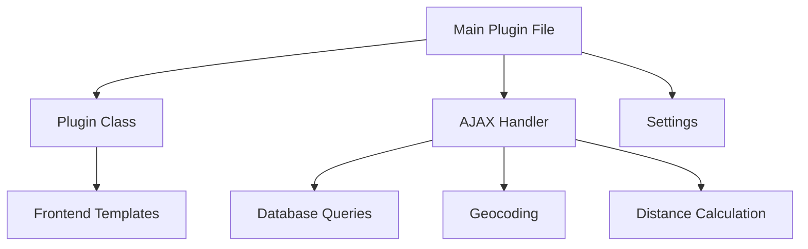
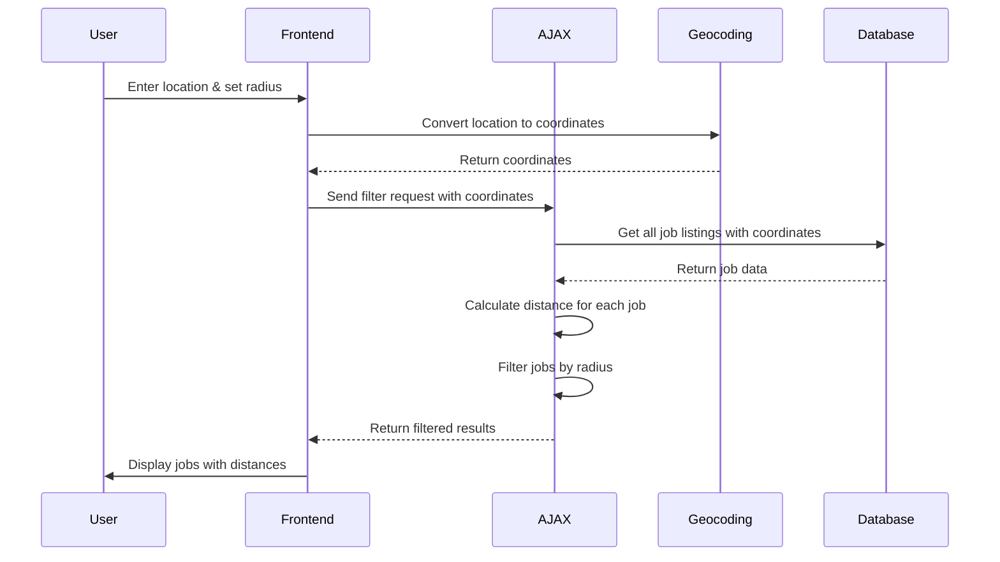

# System Patterns: Job Filtering Plugin

## Architecture Overview

The Job Filtering Plugin follows a modular architecture with clear separation of concerns:

## Core Components

### 1. Main Plugin File (`job-filtering-plugin.php`)
- Entry point for the plugin
- Defines constants and includes required files
- Registers scripts, styles, and AJAX handlers
- Sets up shortcodes and template overrides

### 2. Plugin Class (`class-job-filtering-plugin.php`)
- Handles rendering of filter forms and widgets
- Provides utility methods for retrieving job data
- Manages shortcodes for embedding filters

### 3. AJAX Handler (`class-job-filtering-ajax.php`)
- Processes filter requests asynchronously
- Implements location-based filtering with radius calculations
- Handles geocoding of location inputs
- Returns filtered job results

### 4. Settings Class (`class-job-filtering-settings.php`)
- Manages plugin configuration options
- Handles API keys and regional settings

## Key Design Patterns

### 1. MVC-like Pattern
- **Model**: Database queries and job data retrieval
- **View**: Templates for filter forms and results
- **Controller**: AJAX handler and main plugin class

### 2. Singleton Pattern
- Used for the main plugin class to ensure only one instance exists

### 3. Factory Method Pattern
- Used for creating different types of filter components

### 4. Observer Pattern
- JavaScript event listeners for filter changes
- AJAX callbacks for updating results

## Data Flow

### Location-Based Filtering Flow

## Component Relationships

### Frontend Components
- Filter form (main)
- Filter widget (sidebar)
- Results display
- Pagination

### Backend Components
- Job data retrieval
- Geocoding service
- Distance calculation
- Filter processing

## Technical Patterns

### 1. Geocoding
- Uses Google Maps API for converting addresses to coordinates
- Caches coordinates to reduce API calls
- Supports reverse geocoding for "Use My Location" feature

### 2. Distance Calculation
- Implements Haversine formula for accurate distance calculation
- Filters jobs based on calculated distance from search point
- Displays distance in kilometers in the results

### 3. AJAX-based Filtering
- Real-time filtering without page reloads
- Debounced input handling to prevent excessive requests
- JSON response format for efficient data transfer
